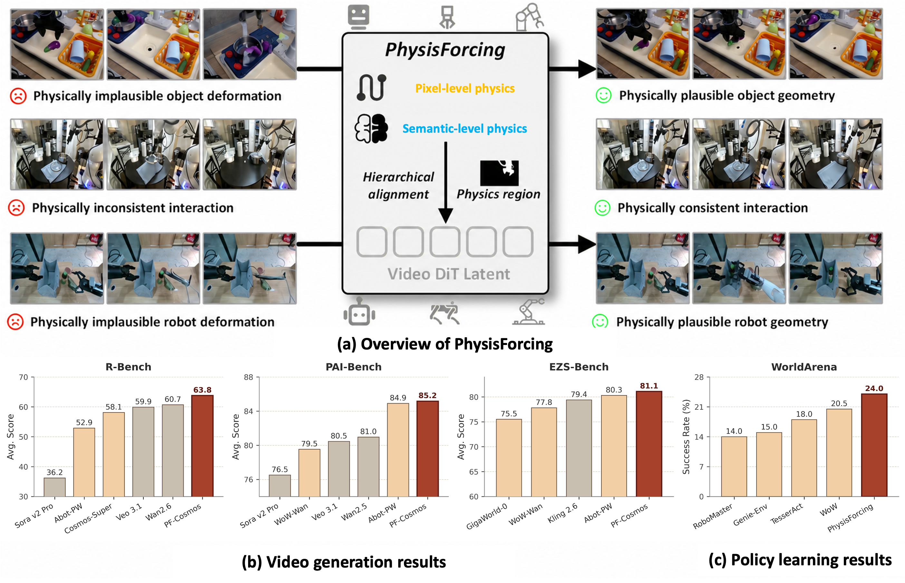

<div align="center">

<!-- Optional: drop a logo at assets/physisforcing_logo.png -->
<!--  -->

# PhysisForcing: Physics Reinforced World Simulator for Robotic Manipulation 🔥

Peiwen Zhang\*, Yufan Deng\*, Shangkun Sun\*, Juncheng Ma, Duomin Wang†, Jonas Du,
Zilin Pan, Ye Huang, Hao Liang, Songyan Huang, Ruihua Zhang, Enze Xie†, Ming-Yu Liu, Daquan Zhou†‡

> Peking University · NVIDIA
>
> \*Equal Contribution&nbsp;&nbsp;†Co-Project Lead&nbsp;&nbsp;‡Corresponding Author

<p align="center">
  <a href="https://dagroup-pku.github.io/PhysisForcing.github.io/"></a>
  <a href="https://arxiv.org/abs/2606.28128"></a>
  <a href="https://huggingface.co/papers/2606.28128"></a>
  <a href="https://huggingface.co/DAGroup-PKU/PF_Cosmos"></a>
  <a href="https://huggingface.co/DAGroup-PKU/PF_Wan"></a>
  <a href="LICENSE"></a>
</p>

</div>

<p align="center"></p>

**PhysisForcing** is a **training-time, plug-and-play** framework that makes robotic video generation **physically plausible**. It focuses supervision on interaction-critical regions and aligns generation at two levels — a **pixel-level trajectory** loss and a **semantic-level relational** loss — on an intermediate DiT feature, dropping into existing video backbones (Wan, Cosmos) with **zero extra inference cost**. It ranks **first on R-Bench, PAI-Bench, and EZS-Bench**, and as a world model lifts the **WorldArena-action planner** closed-loop success rate from **16.0% → 24.0%**.

`PF_Cosmos` = Cosmos3-Nano + PhysisForcing&nbsp;&nbsp;|&nbsp;&nbsp;`PF_Wan` = Wan + PhysisForcing


## 🔥 News
- `[2026.07.08]` 🎉 We release the **inference code & model weights** for **PF_Cosmos** and **PF_Wan**! Training code will be open-sourced **within this week**.
- `[2026.06.29]` 🔥 We release the **[arXiv paper](https://arxiv.org/abs/2606.28128)** and **[project page](https://dagroup-pku.github.io/PhysisForcing.github.io/)** of PhysisForcing.

## 📑 Todo List

- [x] Inference code & checkpoints for **PF_Wan** & **PF_Cosmos**
- [ ] Training code & auxiliary model checkpoints

## 🎥 Demo

**The video below is a compressed preview. Full HD demos and the complete set of side-by-side qualitative comparisons (playable videos across embodiments and tasks) are best viewed on the [Project Page](https://dagroup-pku.github.io/PhysisForcing.github.io/).**


https://github.com/user-attachments/assets/e6d5fefd-5f90-4610-a38f-112a151f48e4


## 📈 Results

All scores are normalized percentages (higher is better, only the **Avg.** column shown). Bold = **PhysisForcing** variants (`PF_Wan14B`/`PF_Wan5B` on Wan, `PF_Cosmos` on Cosmos3-Nano). The first three are embodied video-generation benchmarks; the rightmost is the WorldArena Action Planner world-model evaluation (IDM closed-loop success rate).

<table>
<tr valign="top">
<td>
<table>
<tr><th align="left">R-Bench</th><th>Avg.</th></tr>
<tr><td align="left">Veo 3.1</td><td align="center">56.3</td></tr>
<tr><td align="left">Hailuo v2</td><td align="center">56.5</td></tr>
<tr><td align="left">Cosmos 3-super</td><td align="center">58.1</td></tr>
<tr><td align="left">Seedance 1.5 Pro</td><td align="center">58.4</td></tr>
<tr><td align="left">Wan 2.6</td><td align="center">60.7</td></tr>
<tr><td align="left">Abot-PhysWorld</td><td align="center">52.9</td></tr>
<tr><td align="left">Wan2.2-A14B</td><td align="center">50.7</td></tr>
<tr><td align="left">Wan2.2-A14B (ft)</td><td align="center">57.9</td></tr>
<tr><td align="left"><b>PF_Wan14B</b></td><td align="center"><b>62.0</b></td></tr>
<tr><td align="left">Cosmos 3-nano (ft)</td><td align="center">61.5</td></tr>
<tr><td align="left"><b>PF_Cosmos</b></td><td align="center"><b>63.8</b></td></tr>
</table>
</td>
<td>
<table>
<tr><th align="left">PAI-Bench (robot)</th><th>Avg.</th></tr>
<tr><td align="left">Wan 2.5</td><td align="center">80.96</td></tr>
<tr><td align="left">GigaWorld-0</td><td align="center">80.87</td></tr>
<tr><td align="left">Veo 3.1</td><td align="center">80.45</td></tr>
<tr><td align="left">WoW-Wan 14B</td><td align="center">79.53</td></tr>
<tr><td align="left">Sora v2 Pro</td><td align="center">76.52</td></tr>
<tr><td align="left">Abot-PhysWorld</td><td align="center">84.91</td></tr>
<tr><td align="left">Wan2.2-A14B</td><td align="center">78.93</td></tr>
<tr><td align="left">Wan2.2-A14B (ft)</td><td align="center">79.90</td></tr>
<tr><td align="left"><b>PF_Wan14B</b></td><td align="center"><b>81.73</b></td></tr>
<tr><td align="left">Cosmos 3-nano (ft)</td><td align="center">84.03</td></tr>
<tr><td align="left"><b>PF_Cosmos</b></td><td align="center"><b>85.17</b></td></tr>
</table>
</td>
<td>
<table>
<tr><th align="left">EZS-Bench</th><th>Avg.</th></tr>
<tr><td align="left">WoW-Wan 14B</td><td align="center">77.80</td></tr>
<tr><td align="left">GigaWorld-0</td><td align="center">75.49</td></tr>
<tr><td align="left">Cosmos-Predict 2.5</td><td align="center">73.94</td></tr>
<tr><td align="left">UnifoLM-WMA-0</td><td align="center">62.94</td></tr>
<tr><td align="left">Kling 2.6-Pro</td><td align="center">79.39</td></tr>
<tr><td align="left">Abot-PhysWorld</td><td align="center">80.30</td></tr>
<tr><td align="left">Wan2.2-A14B</td><td align="center">77.16</td></tr>
<tr><td align="left">Wan2.2-A14B (ft)</td><td align="center">79.04</td></tr>
<tr><td align="left"><b>PF_Wan14B</b></td><td align="center"><b>80.54</b></td></tr>
<tr><td align="left">Cosmos 3-nano (ft)</td><td align="center">80.29</td></tr>
<tr><td align="left"><b>PF_Cosmos</b></td><td align="center"><b>81.08</b></td></tr>
</table>
</td>
<td>
<table>
<tr><th align="left">Action Planner</th><th>Avg.</th></tr>
<tr><td align="left">Genie Envisioner</td><td align="center">15.0</td></tr>
<tr><td align="left">TesserAct</td><td align="center">18.0</td></tr>
<tr><td align="left">RoboMaster</td><td align="center">14.0</td></tr>
<tr><td align="left">Vidar</td><td align="center">10.5</td></tr>
<tr><td align="left">WoW</td><td align="center">20.5</td></tr>
<tr><td align="left">Wan2.2-5B (base)</td><td align="center">16.0</td></tr>
<tr><td align="left"><b>PF_Wan5B</b></td><td align="center"><b>24.0</b></td></tr>
</table>
</td>
</tr>
</table>

Full per-metric tables and ablations are in the [paper](https://arxiv.org/abs/2606.28128).

## ⚙️ Usage

This repo hosts two **self-contained** inference bundles — each ships its own framework
code, environment, weights, and example inputs. Pick the one you need and follow its README:

- **[`pf_cosmos/`](pf_cosmos/README.md)** — `PF_Cosmos` (Cosmos3-Nano + PhysisForcing), image-to-video.
- **[`pf_wan/`](pf_wan/README.md)** — `PF_Wan` (Wan2.2-A14B + PhysisForcing), image-to-video.

```bash
git clone https://github.com/DAGroup-PKU/PhysisForcing.git
cd PhysisForcing/pf_cosmos   # or: cd PhysisForcing/pf_wan
# then follow that bundle's README: environment -> weights -> run
```

The two bundles use different PyTorch/CUDA stacks, so set each up in its own environment.

> 🚧 Training code & auxiliary checkpoints: **coming soon.**

## 🙏 Acknowledgement

Our work builds on many excellent projects: [Wan](https://github.com/Wan-Video/Wan2.1), [Cosmos](https://github.com/nvidia-cosmos), [CoTracker3](https://github.com/facebookresearch/co-tracker), [Depth-Anything-2](https://github.com/DepthAnything/Depth-Anything-V2), [V-JEPA](https://github.com/facebookresearch/jepa), and [R-Bench / RoVid-X](https://github.com/DAGroup-PKU/ReVidgen).

## ✏️ Citation

If you find PhysisForcing useful, please consider giving a ⭐ and citing:

```bibtex
@article{zhang2026physisforcing,
  title={PhysisForcing: Physics Reinforced World Simulator for Robotic Manipulation},
  author={Zhang, Peiwen and Deng, Yufan and Sun, Shangkun and Ma, Juncheng and
          Wang, Duomin and Du, Jonas and Pan, Zilin and Huang, Ye and Liang, Hao and
          Huang, Songyan and Zhang, Ruihua and Xie, Enze and Liu, Ming-Yu and Zhou, Daquan},
  journal={arXiv preprint arXiv:2606.28128},
  year={2026}
}
```

## License

This project is released under the [MIT License](LICENSE).
